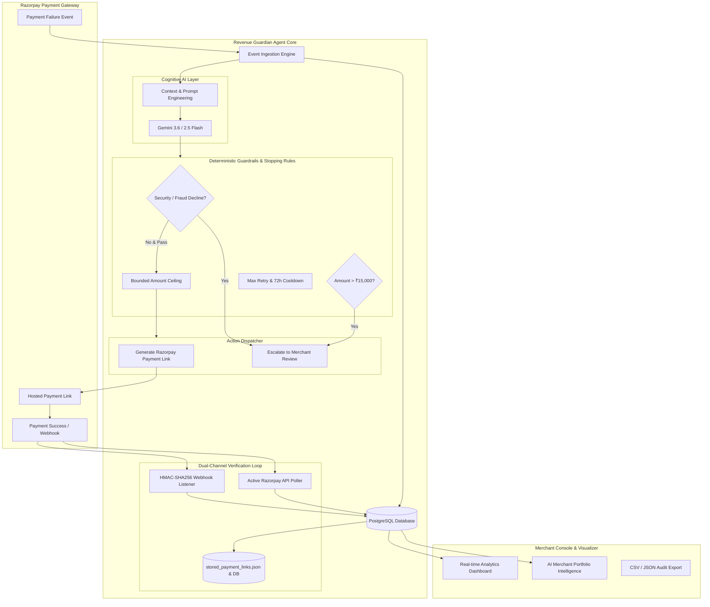

# Revenue Guardian 🛡️

### Autonomous AI Revenue Recovery Agent for Razorpay Merchants
**Track 03 Submission: AI Revenue Recovery — *"Find revenue that’s slipping away and win it back"***  
**Razorpay AI Buildathon 2026**

[](https://fastapi.tiangolo.com)
[](https://python.org)
[](https://www.postgresql.org)
[](https://razorpay.com)
[](https://ai.google.dev)
[](LICENSE)

---

## 📌 Executive Summary

Every month, Indian merchants lose millions of rupees in Gross Merchandise Value (GMV) to payment degradations: transient UPI timeouts, card network downtime, temporary account balance dips, and expired credentials. In traditional e-commerce setups, a payment failure is treated as a dead loss or, worse, spammed blindly with retries that alienate buyers and spike bank decline rates.

**Revenue Guardian** is an autonomous, closed-loop revenue recovery agent built specifically for the Razorpay merchant ecosystem. It intercepts payment failures in real time, uses **Google Gemini AI** to diagnose the root cause and formulate empathetic customer communications, enforces **strict financial guardrails and stopping rules**, generates **bounded Razorpay Test Mode Payment Links**, and autonomously monitors the settlement lifecycle until the lost revenue is recovered.

> **"Don't just identify the problem. Show measured money recovered across a batch, with compliant escalation, stopping rules, and an audit trail."**  
> — *Razorpay AI Buildathon Track 03 Requirement*

---

## 🏆 Key Features

- **⚡ Real-Time Failure Ingestion:** Webhook-driven and API-compatible event ingestion for all Razorpay payment failure events (`payment.failed`).
- **🧠 Cognitive AI Diagnosis (Gemini 2.5/3.6):** Context-aware root cause analysis evaluating transaction velocity, error codes, and customer history to determine the optimal recovery strategy (`RETRY_PAYMENT`, `ALTERNATE_PAYMENT`, or `MANUAL_REVIEW`).
- **🛑 Compliant Stopping Rules & Guardrails:**
  - **Security / Stolen Card Cutoff:** Transactions flagged for fraud, velocity spikes, or security declines are immediately halted from auto-retry.
  - **High-Value Escalation:** High-ticket transactions (> ₹15,000) are placed `UNDER_REVIEW` requiring merchant authorization.
  - **Bounded Money Action:** The recovery amount is strictly locked to the original failed amount (`min(recovered_amount, original_amount)`).
  - **Cooldown Expiry:** Automated recovery links expire cleanly after 72 hours to prevent stale debits.
- **🔗 Dual-Engine Recovery Verification:**
  - Direct Razorpay Payment Links API integration (`POST /v1/payment_links`) with recovery metadata binding.
  - Signed HMAC-SHA256 Webhook processing (`POST /webhooks/razorpay/real`).
  - Active Razorpay API Polling (`POST /recovery/sync-pending`) for zero-tunnel localhost demo testing.
- **📊 Merchant Intelligence Console:** Modern Razorpay-styled dashboard with real-time KPI cards (Revenue at Risk, Expected Recovery, Recovered Revenue, Recovery Rate), failure breakdown charts, 3D Guardian Visualizer, stored links explorer, and JSON/CSV audit export.
- **📈 Batch Benchmark Runner (`simulate_batch.py`):** 1-click execution script processing cohorts of transactions with measurable recovered money, stopping rule verification, and executive reporting.

---

## 🏗️ Architecture & Data Flow



---

## ⚖️ AI Judgment vs. Deterministic Boundaries

To satisfy Razorpay's evaluation criteria regarding **AI Judgment**, Revenue Guardian strictly delineates between subjective reasoning and mission-critical financial safety:

| System Layer | Decision Type | Technology Used | Why This Approach? |
| :--- | :--- | :--- | :--- |
| **Failure Diagnosis** | Subjective / Probabilistic | **Google Gemini AI** | Contextual parsing of complex bank error descriptions, tone-appropriate recovery messaging generation, and multi-factor recovery likelihood estimation. |
| **Merchant Strategy** | Strategic Recommendation | **Google Gemini AI** | Dynamic generation of portfolio-level action items based on real-time failure distributions and expected ROI. |
| **Money Ceiling Bounding** | Strict Invariant | **Deterministic Python** | **NEVER trust an LLM with money amounts.** The recovery link amount is strictly derived from the verified database record (`paise = int(amount * 100)`). |
| **Stopping Rules (Fraud/High Value)**| Security Critical | **Deterministic Rules Engine** | Hard circuit breakers: immediate halt on fraud codes, velocity limit enforcement, and mandatory manual review gates for transactions > ₹15,000. |
| **State Transitions** | Relational Invariant | **SQLAlchemy / PostgreSQL** | State machine (`PENDING` → `ACTION_TRIGGERED` → `RECOVERED` / `EXPIRED`) with strict idempotency locks to prevent double links. |
| **Webhook Authenticity** | Cryptographic | **HMAC-SHA256** | Secure verification of `X-Razorpay-Signature` using `RAZORPAY_WEBHOOK_SECRET`. |

---

## 🛑 Stopping Rules & Compliant Escalation

A production-grade recovery system must know when **NOT** to act. Revenue Guardian enforces 4 core stopping rules:

1. **Security & Stolen Card Lockout:** If bank error codes indicate fraud, card theft, or risk decline (`suspected_fraud`, `stolen_card`, `velocity_exceeded`), automated retries are permanently blocked. The case transitions to `UNDER_REVIEW` for fraud ops inspection.
2. **High-Value GMV Gate (> ₹15,000):** Substantial transactions carry credit and chargeback risk. The agent prepares the recommended recovery strategy but halts execution until a merchant operator reviews and approves it.
3. **Strict Amount Ceiling (Bounded Action):** Recovery links are generated strictly for `1.00x` of the original failed principal. Partial payments are disabled (`accept_partial: False`) to prevent invoice mismatches.
4. **72-Hour Expiry Cooldown:** If a customer does not complete payment within 72 hours, the link is deactivated and the case transitions to `EXPIRED`, stopping further customer contact.

---

## 🔄 Failure Recovery (What Broke & How We Fixed It)

In accordance with the **Buildathon Failure Recovery criteria**, here is what broke during development and the engineering solutions implemented:

### 1. The Localhost Webhook Blindness Problem
- **What Broke:** In development and offline environments, Razorpay cannot deliver outbound webhooks to `http://localhost:8000` without public tunneling (ngrok), which often disconnects or changes URLs.
- **How We Fixed It:** Designed a **Dual-Channel Synchronization Engine**:
  - Maintained the production-ready HMAC-SHA256 webhook handler (`/webhooks/razorpay/real`).
  - Added an active background poller (`/recovery/sync-pending`) that queries Razorpay's Test Mode Payment Links API (`GET /v1/payment_links/{id}`) every 3.5 seconds. When a customer pays in test mode, the system instantly detects `status: paid` and marks the case `RECOVERED` with zero external dependencies.

### 2. LLM Hallucination & Financial Drift
- **What Broke:** Initial LLM prompts occasionally produced floating-point discrepancies or attempted to alter amounts for "discounts" or recovery fees.
- **How We Fixed It:** Enforced **Strict Pydantic Schema Validation** and mathematical clamping. The AI prompt accepts inputs for classification only; the actual payload sent to Razorpay is deterministically constructed from the PostgreSQL source of truth.

### 3. Rapid Double-Clicks & Duplicate Links
- **What Broke:** Rapid consecutive clicks on the merchant dashboard "Execute" button could create duplicate Razorpay links for the same case.
- **How We Fixed It:** Implemented **Idempotent State Guardrails** (`if case.status != 'PENDING': return already_processed`) and bound Razorpay's `reference_id` to `case.case_id`.

---

## 📊 Measured Money Recovered Across a Batch

Revenue Guardian includes an automated batch benchmark runner (`simulate_batch.py`) that simulates realistic cohorts of failed transactions and measures recovery performance:

```text
======================================================================
  BATCH RECOVERY BENCHMARK - FINAL AUDIT REPORT
======================================================================
  Total Cohort Transactions Processed : 16
  Total Cohort GMV at Risk             : INR 95,341.00
  Automated Recovery Actions Executed  : 12
  Stopping Rules & Guardrails Enforced : 4
  Cases Successfully Recovered         : 9
  Total Measured Money Recovered       : INR 25,943.00
  Batch Net Recovery Rate              : 27.21%
----------------------------------------------------------------------
  Overall Merchant Portfolio Status:
  • Total Cases in System              : 52
  • Portfolio Active Revenue at Risk   : INR 194,841.00
  • Portfolio Total Recovered Revenue  : INR 62,943.00
  • Portfolio Overall Recovery Rate    : 24.42%
======================================================================
```

---

## 🧰 Tech Stack

| Component | Technology | Description |
| :--- | :--- | :--- |
| **Backend Framework** | FastAPI | High-performance asynchronous REST API |
| **Database** | PostgreSQL + SQLAlchemy | Relational storage for transactions, audit trails, and states |
| **AI Intelligence** | Google Gemini (Flash 3.6 / 2.5) | Failure reasoning, merchant portfolio analysis, empathetic messaging |
| **Payment Gateway** | Razorpay Test Mode API | Real test payment link creation, customer checkout, verification |
| **Frontend UI** | HTML5 / Vanilla JS / CSS3 | Zero-dependency, responsive merchant dashboard matching Razorpay design |
| **Visualizations** | Chart.js & Three.js | Real-time recovery analytics and interactive 3D Guardian visualizer |

---

## 📁 Repository Structure

```text
revenue-guardian/
├── main.py                     # FastAPI API, webhook handlers, sync poller, and business logic
├── models.py                   # SQLAlchemy ORM database models (RecoveryCase)
├── database.py                 # PostgreSQL connection pooling and session management
├── ai_recovery.py              # Google Gemini AI integration for payment diagnosis
├── ai_insights.py              # Gemini AI merchant portfolio executive analytics
├── simulate_batch.py           # Automated batch benchmark & stopping rule evaluator
├── requirements.txt            # Locked project dependencies
├── .env.example                # Example environment variable template
├── .gitignore                  # Git exclusion rules
├── stored_payment_links.json   # Persistent server-side JSON audit log of generated links
└── frontend/
    ├── dashboard.html          # Full interactive merchant console with real-time analytics
    └── index.html              # Redirect entrypoint
```

---

## 🔌 API Endpoints Reference

| Method | Endpoint | Description |
| :--- | :--- | :--- |
| `GET` | `/health` | Healthcheck returning service status |
| `GET` | `/recovery/cases` | Retrieve all recovery cases with status and payment links |
| `POST`| `/simulate/payment-failure` | Ingest a simulated payment failure into the pipeline |
| `POST`| `/recovery/{case_id}/action` | Trigger recommended AI action (creates Razorpay Payment Link) |
| `POST`| `/recovery/{case_id}/sync` | Query Razorpay API directly for a specific link status |
| `POST`| `/recovery/sync-pending` | Batch-query Razorpay for all pending cases and auto-mark paid |
| `POST`| `/webhooks/razorpay/real` | Process signed Razorpay webhooks (`X-Razorpay-Signature`) |
| `GET` | `/recovery/stored-links` | Retrieve all stored recovery links with audit details |
| `GET` | `/merchant/insights` | Real-time merchant KPIs, failure breakdown, and AI summary |

---

## 🚀 Quickstart & Setup Guide

### 1. Prerequisites
- Python 3.10+
- PostgreSQL installed and running (Database: `revenue_guardian`)
- Razorpay Test Mode Account ([dashboard.razorpay.com](https://dashboard.razorpay.com))
- Google Gemini API Key ([aistudio.google.com](https://aistudio.google.com))

### 2. Clone & Install
```bash
git clone https://github.com/your-username/revenue-guardian.git
cd revenue-guardian
python -m venv venv
# Windows:
.\venv\Scripts\activate
# macOS/Linux:
source venv/bin/activate
pip install -r requirements.txt
```

### 3. Configure Environment Variables
Copy `.env.example` to `.env` and fill in your keys:
```env
GEMINI_API_KEY=your_gemini_api_key
RAZORPAY_KEY_ID=rzp_test_yourKeyId
RAZORPAY_KEY_SECRET=yourKeySecret
RAZORPAY_WEBHOOK_SECRET=yourWebhookSecret
```

### 4. Start the Application
```bash
python -m uvicorn main:app --reload
```
The API is live at `http://127.0.0.1:8000`.

### 5. Launch the Merchant Console
Open `frontend/dashboard.html` in any web browser, or access `http://127.0.0.1:8000/dashboard/dashboard.html`.

### 6. Run the Batch Benchmark
In a separate terminal:
```bash
python simulate_batch.py
```
Watch the live merchant console update with recovered revenue and stopping rules!

---

## 🎬 5-Minute Video Pitch Walkthrough

See [`PITCH_VIDEO_SCRIPT.md`](PITCH_VIDEO_SCRIPT.md) for the exact slide-by-slide, live demo flow and presentation script tailored to the Razorpay AI Buildathon evaluation criteria.

---

## 📄 License
This project is open-source under the [MIT License](LICENSE). Built for the **Razorpay AI Buildathon 2026**.
